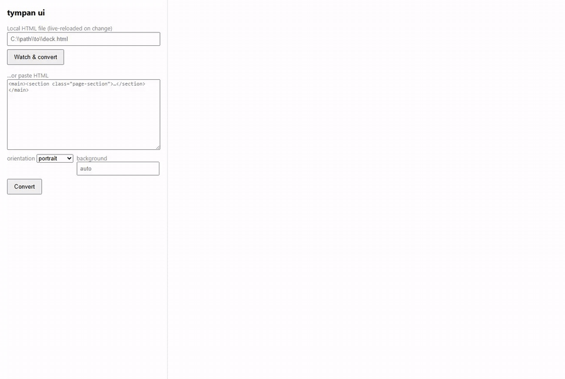

# tympan

[](https://github.com/Blvckpanda/Tympan/actions/workflows/ci.yml)
[](https://github.com/Blvckpanda/Tympan/actions/workflows/release.yml)
[](https://www.npmjs.com/package/tympan)
[](LICENSE)

**A deterministic, secure, fast HTML→PDF converter that produces verifiable
PDFs with zero configuration.** One semantic section per page — hero page
included, your page background carried over — runtime print-CSS defeated,
output self-verified. Built for the single-file HTML bundles AI assistants
produce. The charter is [SPEC.md](SPEC.md); the roadmap below is real and
staged.



Plain Playwright's `page.pdf()` prints whatever the page's print CSS says — which is
exactly what breaks AI HTML: runtime-injected `@media print` rules force page breaks
on every section, clamp covers to `100vh`, and cap pages with `@page` rules. tympan
defeats that pipeline instead of fighting it.

## Quickstart

```bash
npx tympan brief.html
# brief.pdf (A4 portrait by default) + brief-email.pdf, verified, links clickable
```

Landscape for slide decks: `npx tympan deck.html --orientation landscape`.
Force a page color: `--background "#04060a"`. Fully offline: `--offline`.

Or install the `tympan` command globally:

```bash
npm install -g tympan
tympan brief.html
```

Preview it locally while you edit:

```bash
npm run ui        # or: npx -p tympan tympan-ui  (local server, live reload, PDF pane)
```

Library:

```js
import { convert } from 'tympan';
const { master, email, detection, verification, blockedRequests } = await convert('brief.html', {
  email: true,
  outline: true,
  probe: /www\.example\.city/,
});
if (!verification.ok) throw new Error('verification failed');
```

Requires Node ≥ 20 and a Chromium binary (`npx playwright install chromium`, or point
`TYMPAN_CHROMIUM` at any chrome executable).

## Why it wins

1. **Reproducible, proven:** identical input + options → **byte-identical
   PDFs** under the exact-pinned engine (fixed metadata epoch, input-derived
   `/ID`, `tympan:<hash>` keyword). Pinned by a twice-convert sha256 test —
   on fixtures and on a real 8-page document.
2. **Safe on untrusted HTML by default:** non-top-level `file://` reads are
   blocked, and private/link-local network requests are denied — including
   the cloud-metadata endpoints. Every block is counted and reported.
   Loosening is explicit: `--allow-net <host>`, or `--offline` for none.
3. **Faithful output:** portrait A4 like the document you wrote, your dark
   background (or any `--background`), the pre-section hero as page 1, the
   footer on the last page, source-width layout, selectable text, clickable
   links, bookmarks, real metadata.
4. **Diagnostics that say exactly what broke:** per-section progress,
   page-count and probe verification, blocked-request counts, non-zero exit
   codes for CI.

And the principle under all of it: **never trust a measurement.** Sections
are printed, the artifact is inspected, and the scale shrinks until the
one-page invariant *holds* — late webfonts and print rounding can't produce
sliver pages. A regression test pins this ([test/spill.test.mjs](test/spill.test.mjs)).

## Screenshots

**tympan ui** — paste HTML or watch a local file, watch sections convert one by
one (here: a dark-portrait brief — hero detected, 4 pages from 4 blocks):


The pitch as a card (also the repo's social preview — [1280×640](assets/social-card.png)):

<p align="center"></p>

## What it does

1. **Detects sections** in the rendered page: your `--selector`, then
   `section.page-section`, then `[data-page]`/`[data-slide]`, then
   `<section>`/`<article>` children of the widest main-ish container, then the whole
   document as one page.
2. **Captures the frame around the sections:** pre-section content (hero/cover)
   becomes page 1; a trailing footer band merges into the last page. Scroll
   chrome (nav bars, banners) stays out — it's not paper.
3. **Builds a clean document** per section: the page's stylesheets (including
   runtime-injected body-level ones) and the source's own page background —
   no React runtime, no injected print CSS, no `@page` caps.
4. **Prints each section onto exactly one page**, shrinking just enough when a
   section exceeds the text area — in either dimension (width is fitted too;
   nothing gets right-clipped).
5. **Merges centered** via pdf-lib — text stays selectable, **hyperlinks stay
   clickable**, and each final page is painted with the document's background
   first, margins included.
6. **Verifies** the result: page count === expected, last-page text probe,
   blocked-request tally, non-zero exit on any mismatch (CI-friendly).

## Options (CLI and library)

| Option | Default | Description |
|---|---|---|
| `selector` | auto-detect | Explicit CSS selector for sections |
| `email` | off | Also emit an image-downscaled variant (`emailMaxWidth`/`emailQuality` to tune) |
| `out` | `<input>.pdf` | Master output path |
| `probe` | none | Text (or regex source) that must appear on the last page |
| `format` | `a4` | `a4` or `letter` |
| `orientation` | `portrait` | `portrait` or `landscape` (slide decks) |
| `background` | the source's own | Page background color (CSS color) |
| `margin` | `0.4,0.5,0.4,0.5` | Page margins in inches: `N` or `T,R,B,L` (CLI) |
| `teaser` | none | Only convert the first N sections (CLI: `--teaser N`) |
| `outline` | off | PDF bookmarks panel — one entry per section (`--outline`) |
| `title` | source `<title>` | PDF metadata title |
| `author` / `subject` / `creator` | none | PDF metadata fields |
| `offline` | off | Block every network request |
| `allowNet` | none | Hosts permitted despite the private-network blocklist (repeatable) |
| `waitFor` | none | CSS selector to wait for before printing (charts, JS-mounted content; `--wait-for`) |
| `waitTimeout` | `10000` | Timeout (ms) for `waitFor` |
| `verify` | `true` | Self-verification pass (`--no-verify` to skip) |

Diagnostics: `tympan doctor` checks the environment (Node version, exact
playwright pin vs installed, Chromium, ffmpeg) and exits non-zero on failure;
`tympan deck.html --json` prints a stable machine-readable report on stdout
(progress stays on stderr) for CI to consume.

## How is this different from Playwright / Gotenberg / WeasyPrint?

| | Rendering engine | AI-HTML pagination | One section per page | Self-verifying |
|---|---|---|---|---|
| Playwright / Puppeteer | Chromium | whatever the page's print CSS dictates — often broken | no | no |
| Gotenberg | Chromium (Docker API) | same as Playwright | no | no |
| WeasyPrint / Dompdf | no JS — cannot render AI bundles at all | — | — | — |
| **tympan** | Chromium (via Playwright, exact-pinned) | **defeats runtime print CSS by cloning each section into a clean document** | **guaranteed, with auto-shrink in both dimensions** | **built in, exit codes for CI** |

tympan is an opinionated *layer* on Chromium, not a new engine: the value is the
pipeline, not the renderer.

## Roadmap

The staged plan lives in [SPEC.md](SPEC.md) (phases §4, adoption decisions §10).
Where things stand:

- **Now (v0.5):** the reliable core — portrait default, background-faithful
  pages, hero capture, closed-loop shrink-to-fit (regression-tested),
  byte-identical output, secure-by-default request gating with
  `--offline`/`--allow-net` escapes, links + outline + metadata, email
  variant, preview UI, self-verification with CI exit codes, tag-driven
  releases with provenance and **zero npm tokens**.
- **Now (v0.6):** `--wait-for <selector>` waits, `tympan doctor`, `--json`
  reports, URL input. Remaining from Phase 1: presets + config file, batch
  mode, stdin/glob input.
- **v0.7+ — standards (Phase 2):** tagged PDF/PDF-UA, PDF/A, size
  optimization, `lint`, `test` (visual regression for CI).
- **v0.7+ — standards (Phase 2):** tagged PDF/PDF-UA, PDF/A, size
  optimization, `lint`, `test` (visual regression for CI).

Non-goals (from the spec): our own layout engine, a GUI, a general PDF
editor, Word/PowerPoint conversion, OCR, AI in the render path.

## Limitations (honest ones)

- Content that lives **only** in print media CSS won't appear: the whole point is
  printing the screen composition with the app's runtime print CSS stripped out.
- Gradient page backgrounds are carried into the template but the
  margins-painting pass applies the solid base color — a gradient sheet keeps
  its gradient inside the content column only.
- One section = one page is a hard rule: an overfull section shrinks to fit rather
  than flowing onto a second page.
- Determinism holds under the exact-pinned engine (`playwright` is
  version-locked); a Chromium update is a rendering change and bumps bytes.

## Contributing & releasing

PRs welcome — see [CONTRIBUTING.md](CONTRIBUTING.md) for setup and the test gates.
Releases are cut by version tags; the process lives in
[PUBLISHING.md](PUBLISHING.md). The social preview card is
[assets/social-card.png](assets/social-card.png) (1280×640).

## Status

v0.5.0 is on npm: portrait + fidelity, proven determinism, secure defaults,
full CLI, clickable links preserved through the merge, PDF outline +
metadata, the local preview UI, and tag-driven release automation with
provenance. See [CHANGELOG](CHANGELOG.md) for history.

## License

[MIT](LICENSE)
