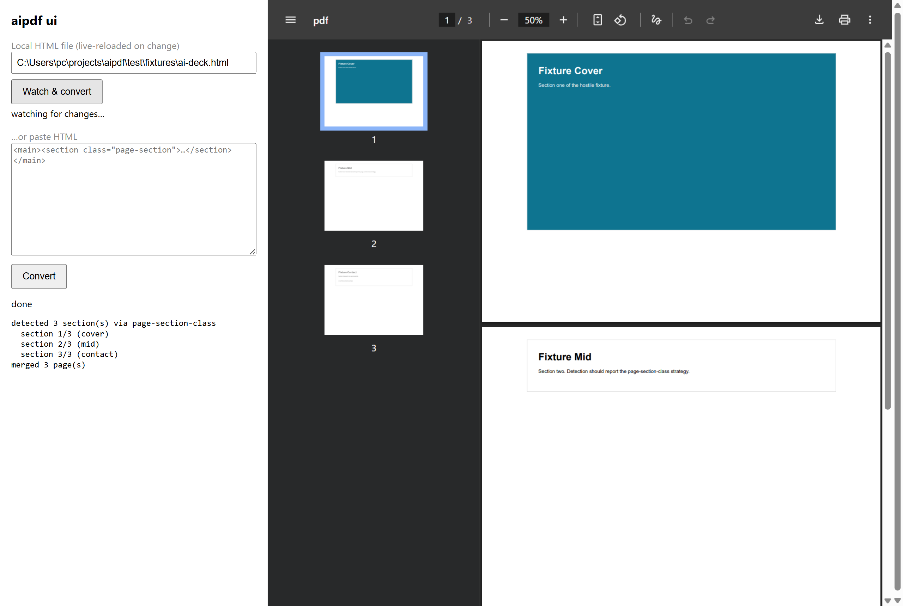

# aipdf

[](https://github.com/Blvckpanda/aipdf/actions/workflows/ci.yml)
[](https://github.com/Blvckpanda/aipdf/actions/workflows/release.yml)
[](https://www.npmjs.com/package/aipdf)
[](LICENSE)

Zero-config HTML→PDF converter for **AI-generated documents** — the React/Tailwind
single-file bundles that AI assistants produce. One semantic section per page,
runtime print-CSS defeated, self-verifying output.


Plain Playwright's `page.pdf()` prints whatever the page's print CSS says — which is
exactly what breaks AI HTML: runtime-injected `@media print` rules force page breaks
on every section, clamp covers to `100vh`, and cap pages with `@page` rules. aipdf
defeats that pipeline instead of fighting it.

## Quickstart

```bash
npx aipdf deck.html
# deck.pdf + deck-email.pdf, one section per page, links clickable, verified
```

Preview it locally while you edit:

```bash
npm run ui        # or: npx aipdf-ui  (local server, live reload, PDF pane)
```

Library:

```js
import { convert } from 'aipdf';
const { master, email, detection, verification } = await convert('deck.html', {
  email: true,
  outline: true,
  probe: /www\.example\.city/,
});
if (!verification.ok) throw new Error('verification failed');
```

Requires Node ≥ 20 and a Chromium binary (`npx playwright install chromium`, or point
`AIPDF_CHROMIUM` at any chrome executable).

## Screenshots

**aipdf ui** — paste HTML or watch a local file, watch sections convert one by
one, read the result in the browser's native PDF viewer:



The pitch as a card (also the repo's social preview — [1280×640](assets/social-card.png)):

<p align="center"></p>

## What it does

1. **Detects sections** in the rendered page: your `--selector`, then
   `section.page-section`, then `[data-page]`/`[data-slide]`, then
   `<section>`/`<article>` children of the widest main-ish container, then the whole
   document as one page.
2. **Builds a clean document** per section: static stylesheets only — no React
   runtime, no injected print CSS, no `@page` caps.
3. **Prints each section onto exactly one page**, shrinking just enough when a
   section is taller than the page (never spilling onto a sliver page).
4. **Merges centered** via pdf-lib — text stays selectable and **hyperlinks stay clickable**.
5. **Verifies** the result: page count === section count, last-page text probe,
   non-zero exit on any mismatch (CI-friendly).

## Options (CLI and library)

| Option | Default | Description |
|---|---|---|
| `selector` | auto-detect | Explicit CSS selector for sections |
| `email` | off | Also emit an image-downscaled variant (≤1600px JPEG q0.82) |
| `out` | `<input>.pdf` | Master output path |
| `probe` | none | Text (or regex source) that must appear on the last page |
| `format` | `a4` | `a4` or `letter` |
| `orientation` | `landscape` | `landscape` or `portrait` |
| `margin` | `0.4,0.5,0.4,0.5` | Page margins in inches: `N` or `T,R,B,L` (CLI) |
| `teaser` | none | Only convert the first N sections (CLI: `--teaser N`) |
| `outline` | off | PDF bookmarks panel — one entry per section (`--outline`) |
| `title` | source `<title>` | PDF metadata title |
| `author` | none | PDF metadata author |
| `verify` | `true` | Self-verification pass (`--no-verify` to skip) |

## How is this different from Playwright / Gotenberg / WeasyPrint?

| | Rendering engine | AI-HTML pagination | One section per page | Self-verifying |
|---|---|---|---|---|
| Playwright / Puppeteer | Chromium | whatever the page's print CSS dictates — often broken | no | no |
| Gotenberg | Chromium (Docker API) | same as Playwright | no | no |
| WeasyPrint / Dompdf | no JS — cannot render AI bundles at all | — | — | — |
| **aipdf** | Chromium (via Playwright) | **defeats runtime print CSS by cloning each section into a clean document** | **guaranteed, with auto-shrink** | **built in, exit codes for CI** |

aipdf is an opinionated *layer* on Chromium, not a new engine: the value is the
pipeline, not the renderer.

## Limitations (honest ones)

- The PDF **Producer** field stays `pdf-lib`'s — its `save()` hardcodes it. Title,
  author, and subject set via `--title`/`--author`/`--subject` persist normally.
- Content that lives **only** in print media CSS won't appear: the whole point is
  printing the screen composition with the app's runtime print CSS stripped out.
- Background images and graphics render fine (vector merge, `printBackground: on`);
  what's *not* preserved is print-only styling.
- One section = one page is a hard rule: an overfull section shrinks to fit rather
  than flowing onto a second page.

## Contributing & releasing

PRs welcome — see [CONTRIBUTING.md](CONTRIBUTING.md) for setup and the test gates.
Releases are cut by version tags; the process lives in
[PUBLISHING.md](PUBLISHING.md). The social preview card is
[assets/social-card.png](assets/social-card.png) (1280×640).

## Status

v0.3.3 is on npm: full CLI, clickable links preserved through the merge, PDF
outline + metadata, the local preview UI, and tag-driven release automation
with provenance. See [CHANGELOG](CHANGELOG.md) for the roadmap.

## License

[MIT](LICENSE)
